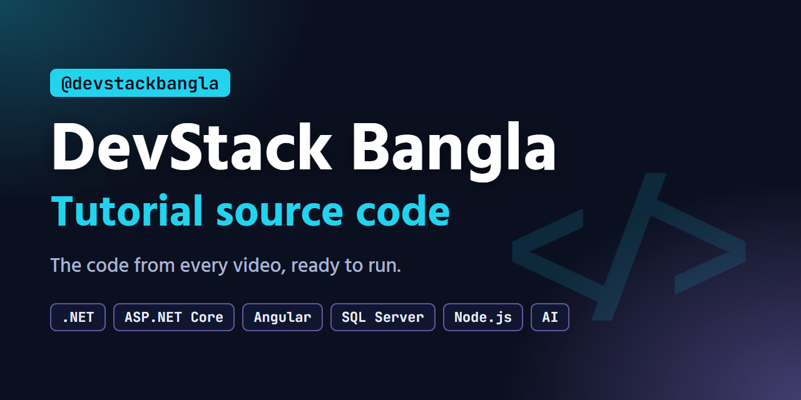

# DevStack Bangla: Tutorial Source Code

[](https://www.youtube.com/@devstackbangla) [](https://github.com/touhidalam69/DevStack_Bangla_tutorial_source_code/actions/workflows/build.yml) [](LICENSE)

The source code for every video on [DevStack Bangla](https://www.youtube.com/@devstackbangla): Bangla tutorials on
.NET and C#, ASP.NET Core, Angular, SQL Server, PostgreSQL, Node.js and AI, for students, junior and working
developers. Each folder is the project exactly as it ran in its video: the code, the commands and the output on
screen come from it, and every project is built and tested on each change.

DevStack Bangla চ্যানেলের ভিডিওগুলোর source code। প্রতিটা ভিডিওর description-এ এখানকার folder-এর link আছে।

## Videos

<!-- videos:start -->
| # | Video (click for the code) | Stack | YouTube |
| --- | --- | --- | --- |
| 0 | [Will AI Replace Software Engineers? A 2026 Guide for Junior Developers](src/ai-junior-dev-careers) | Node.js | [▶ Watch](https://youtu.be/9nSyX7AyogQ) |
| 1 | [Stack Overflow Survey 2026: 10 Findings for Developers (in Bangla)](src/so-survey-2026) | Node.js | Coming soon |
| 2 | [ASP.NET Core Web API with Angular \| Full Stack Project Ep 1: Setup and CORS](src/jobtrack-ep01-setup) | .NET 10, Angular 22 | Coming soon |
| 3 | [Claude Code Tutorial (Bangla): The Agent Said Done, My Test Said Fail](src/claude-code-tutorial) | Node.js | Coming soon |
| 4 | [C# Interview Questions and Answers: 10 Guess-the-Output Questions (2026)](src/csharp-interview-questions) | .NET 10 | Coming soon |
| 5 | [Entity Framework Core Tutorial: SQL Server CRUD \| Full Stack Ep 2 (Bangla)](src/jobtrack-ep02-efcore) | .NET 10, EF Core 10, SQL Server, Angular 22 | Coming soon |
| 6 | [MCP Server Tutorial: Build Your Own MCP Server in C# (.NET 10)](src/mcp-server-csharp) | .NET 10 | Coming soon |
| 7 | [SQL Interview Questions and Answers: JOIN, NULL, GROUP BY, Window Functions (2026)](src/sql-interview-questions) |  | Coming soon |
| 8 | [Minimal API vs Controller: Validation and ProblemDetails \| ASP.NET Core Ep 3 (Bangla)](src/jobtrack-ep03-minimal-api) | .NET 10, EF Core 10, SQL Server, Angular 22 | Coming soon |
|  | [C# New Features: Records, Pattern Matching, Primary Constructors and C# 14 (old code vs modern)](src/modern-csharp-features) | .NET 10 | Coming soon |
<!-- videos:end -->

## Get the code

**One video:** click its title in the table above, then **Download source.zip**, or browse the files on GitHub.

**Everything:**

```
git clone https://github.com/touhidalam69/DevStack_Bangla_tutorial_source_code.git
```

**One folder with git**, without downloading the rest:

```
git clone --filter=blob:none --sparse https://github.com/touhidalam69/DevStack_Bangla_tutorial_source_code.git
cd DevStack_Bangla_tutorial_source_code
git sparse-checkout set src/jobtrack-ep03-minimal-api
```

## What you need

Each folder's README lists the exact versions its project uses and how to run it. Across the channel:

| Tool | Used for |
| --- | --- |
| [.NET 10 SDK](https://dotnet.microsoft.com/download) | ASP.NET Core Web API, EF Core |
| [Node.js 24 LTS](https://nodejs.org/) | Angular apps and the Node.js demos |
| SQL Server: LocalDB (with Visual Studio) or [Express / Developer](https://www.microsoft.com/sql-server/sql-server-downloads) | the JobTrack database |
| Git Bash with `curl` and [`jq`](https://jqlang.org) | the API calls shown in the videos |

## The JobTrack series

JobTrack is a job-application tracker built over the full-stack series: ASP.NET Core Web API, EF Core,
SQL Server and Angular. Each episode's folder is the whole project at the end of that episode, so you can start
from any episode. Its README links to the previous and the next one.

## Repository layout

```
src/<video>/
├── README.md      what the video covers, how to run the project, its file tree
├── source.zip     the same files, as one download
└── ...            the project
```

Everything in `src/` is published from the videos' projects, so a fix is made there and published again rather
than edited here. See [CONTRIBUTING.md](CONTRIBUTING.md).

## Questions and problems

- About a video: ask in its comments, in Bangla or English.
- The code does not run: [open an issue](https://github.com/touhidalam69/DevStack_Bangla_tutorial_source_code/issues/new/choose)
  with the folder, the command and the full error.

## License

The code is under the [MIT License](LICENSE): use it in your own projects, including commercial ones. Data that a
demo downloads keeps its own license; for example, the Stack Overflow Developer Survey data is under the Open
Database License 1.0.
